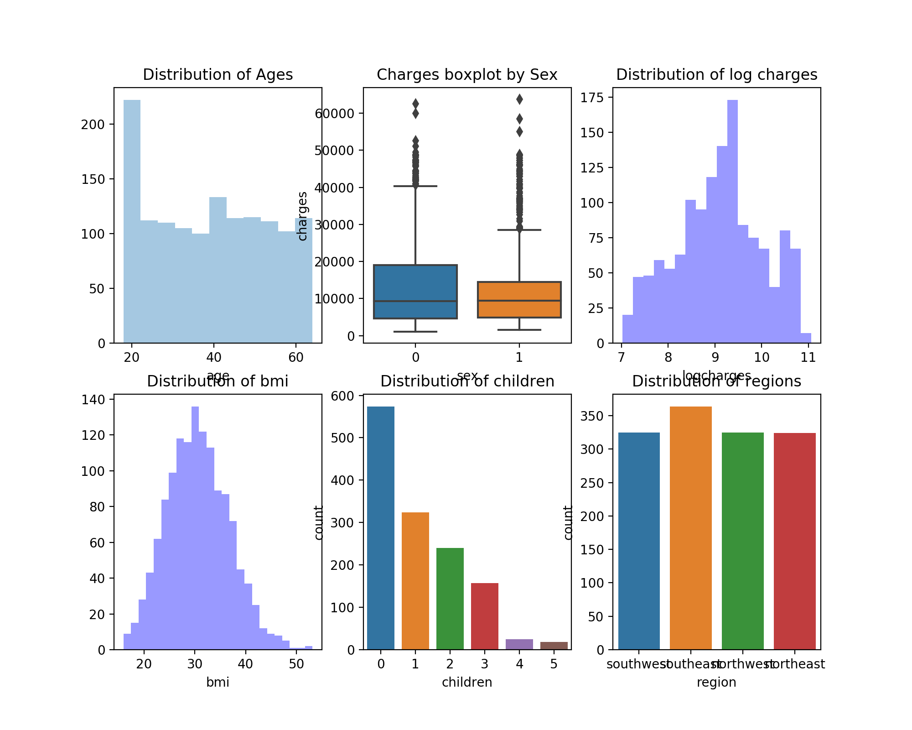
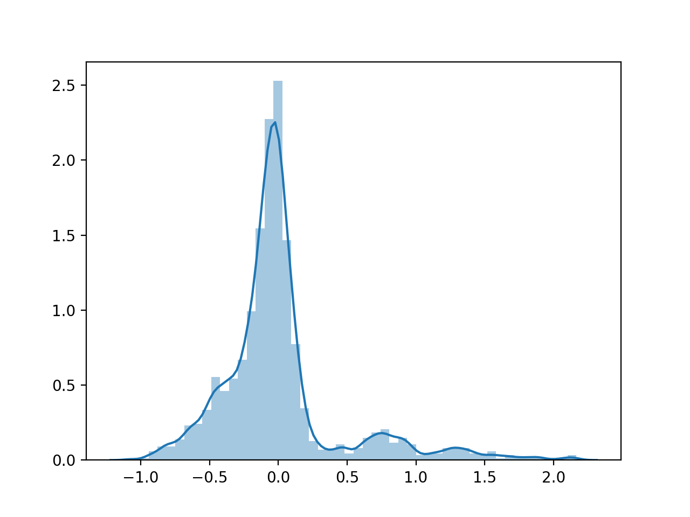
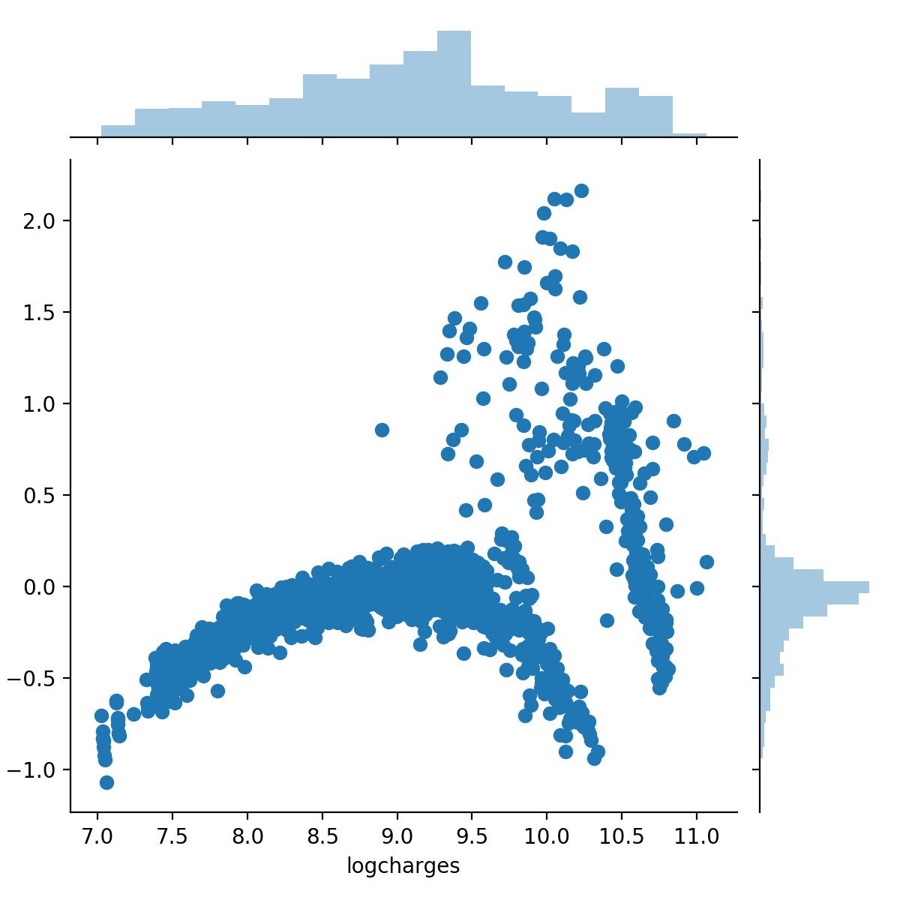
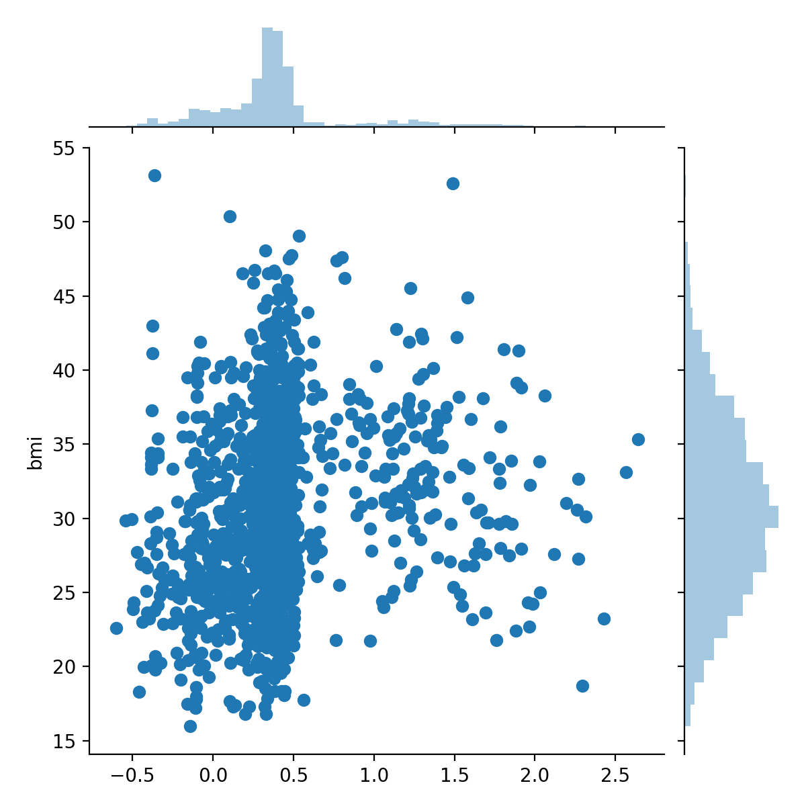
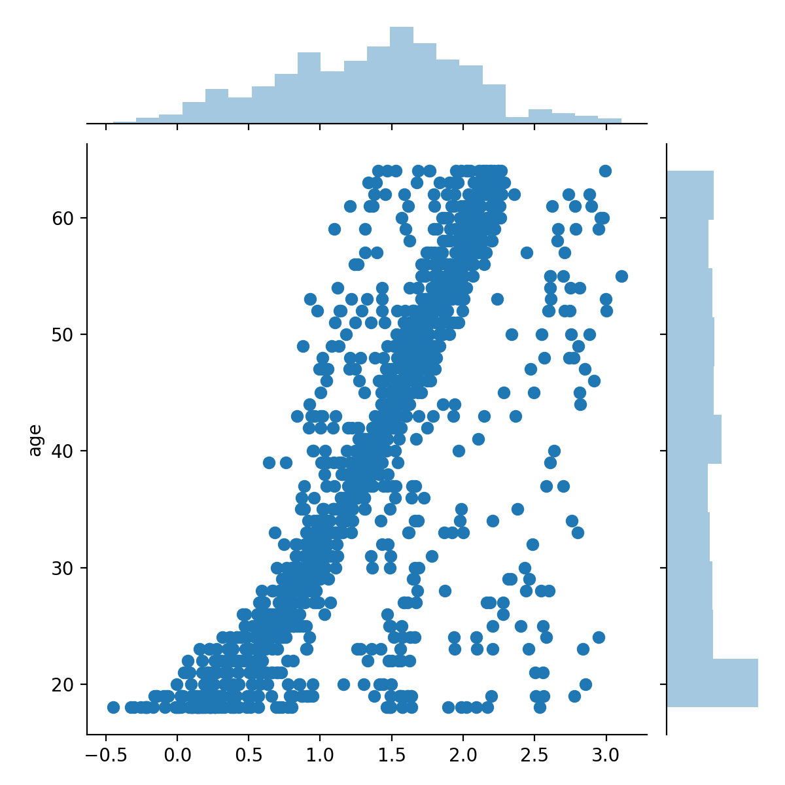

# {.tabset}

## Data Discription {#tab-1}

SOMETHING ABOUT THE INSURANCE DATA

## By Python {#tab-2}

### Python

```{r setup, include = FALSE}
devtools::install_github('rstudio/reticulate')
knitr::knit_engines$set(python = reticulate::eng_python)
```

The following packages are used in Python version of the tutorial.

```{python, eval = FALSE}
import pandas as pd
import numpy as np
import seaborn as sns
import matplotlib.pyplot as plt
from statsmodels.regression.linear_model import OLS
from statsmodels.tools import add_constant
```

```{python, include = FALSE}
import pandas as pd
import numpy as np
from statsmodels.regression.linear_model import OLS
from statsmodels.tools import add_constant
```

#### Data Preprocessing

```{python}
#read the data and save as a dataframe
ds0 = pd.DataFrame(pd.read_csv('~/Desktop/506/groupproject/insurance.csv'))

#have a glimpse of the data
print(ds0.head())
print(ds0.columns)

#check if there is any null
ds0.isnull().sum()
#no null :)

# map the character to factor variable
ds0.sex = ds0.sex.map({'female':1, 'male':0})
ds0.smoker = ds0.smoker.map({'yes':1, 'no':0})
ds_reg = pd.get_dummies(ds0['region'])

# since we change it to dummy variables, we have to drop one of the column
ds0 = ds0.join(ds_reg.iloc[:,0:3])
```

#### Data Visualization

```{python}
ds0['logcharges'] = np.log(ds0.charges)
ds1 = ds0.drop(['charges','region'],axis=1)
```

```{r,echo=FALSE,fig.align='center', out.width='50%'}
knitr::include_graphics("charges.png")
```

```{python, eval = FALSE}
import seaborn as sns
import matplotlib.pyplot as plt
# As we can see, the charges have a heavy tail. So, we take log on it.
sns.distplot(ds0['charges'], color='b')
# Data in every other column looks fine right now.
f,ax = plt.subplots(2,3,figsize=(10,8))
sns.distplot(ds1["age"], kde=False, ax=ax[0,0])
sns.boxplot(x='sex',y='charges', data=ds0, ax=ax[0,1])
sns.distplot(ds1['logcharges'], ax=ax[0,2], kde=False, color='b')
# The logcharges are now normally distributed.
sns.distplot(ds1['bmi'],ax=ax[1,0], kde=False, color='b')
sns.countplot('children',data=ds1, ax=ax[1,1])
sns.countplot('region',data=ds0, ax=ax[1,2])

ax[0,0].set_title('Distribution of Ages')
ax[0,1].set_title('Charges boxplot by Sex')
ax[0,2].set_title('Distribution of log charges')
ax[1,0].set_title('Distribution of bmi')
ax[1,1].set_title('Distribution of children')
ax[1,2].set_title('Distribution of regions')
```

```{r,echo=FALSE,fig.align='center'}

```

#### Optional Step 

_Actually centralize is not a must, which would not change the general result of the regression. In this example, we won't do so._

```{python, eval = FALSE}
def centralize(arra):
    cen = arra - np.mean(arra)
    var = np.sqrt(sum(cen**2)/(len(arra)-1))
    arra = cen/var
    return arra
ds0.bmi = centralize(ds0.bmi)
ds0.age = centralize(ds0.age)
```


#### Model Diagnostics

Firstly, we define dependent variable y and covariates X for future convenience.

```{python}
y = ds1.logcharges
X = ds1.drop(['logcharges'], axis = 1)

#Conduct the first regression!
regr_1 = OLS(y, add_constant(X)).fit()
```

### VIF

```{python}
def variance_inflation_factor(exog, exog_idx):
    k_vars = exog.shape[1]
    x_i = exog.iloc[:, exog_idx]
    mask = np.arange(k_vars) != exog_idx
    x_noti = exog.iloc[:, mask]
    r_squared_i = OLS(x_i, x_noti).fit().rsquared
    vif = 1. / (1. - r_squared_i)
    return vif
    
# We skip the constant column.
VIF = [variance_inflation_factor(add_constant(X), i) for i in range(1,X.shape[1]+1)]
print(VIF)
```

The vif of each column is ok. All of them are smaller than 5, even 2. 


### Residual Distribution
```{python, eval = FALSE}
sns.distplot(regr_1.resid) 
```

```{r,echo=FALSE,fig.align='center', out.width='50%'}

```

Acting like normal which is good.
Since the residual itself is normal, box-cox is not necessary.

### Box-Cox transformation
```{python, eval = FALSE}
namda = 0.1
regr_test = OLS((y**namda-1)/namda, add_constant(X)).fit()
sns.jointplot((y**namda-1)/namda, regr_test.resid)
sns.distplot(regr_test.resid)
```

### Residual Plot
If the regression works well, the dependent data should be uncorrelated with the residual. If we have gaussian prerequisite, independence is what we expect.

```{python, eval = FALSE}
sns.jointplot(y, regr_1.resid) 
```

```{r,echo=FALSE,fig.align='center', out.width='50%'}

```

_The residual plot looks very strange. Y and residual are highly dependent. Maybe the model is not linear at the first place. Since there is explicit non-linear in this model, we have to add some non-linear covariates in it._

### partial residual plot
Which attempts to show how covariate is related to dependent variable, if we control for the effects of all other covariates.

```{python, eval = FALSE}
f,ax = plt.subplots(1,2,figsize=(10,8))
sns.jointplot(regr_1.params.bmi * X.bmi + regr_1.resid, X.bmi, ax=ax[0,0])
sns.jointplot(regr_1.params.age * X.age + regr_1.resid, X.age, ax=ax[0,1])
```

```{r,echo=FALSE, out.width='50%'}


```

Partial residual plots show that both bmi and age could significantly affect the charges.

#### Model Selection

For this part, we would try different adding variables and try to drop variables that are useless.
The primary concern in this case is that we have to add variables so that the residual is relatively indep with y.

* ### Original model
```{python}
print(regr_1.summary())
```

* ### The first try : add an interactive covariate smoker:bmi
```{python}
X_2 = X.iloc[:,:]
X_2['sm_bm'] = X_2.smoker * X_2.bmi
regr_test = OLS(y, add_constant(X_2)).fit()
print(regr_test.summary())
# which certainly improve the performance of the model
```

* ### The second try : add an interactive covariate smoker:age
```{python}
X_2['sm_ag'] = X_2.smoker*X_2.age
regr_test = OLS(y, add_constant(X_2)).fit()
print(regr_test.summary())
# which increase the performance of the model significantly
```

Since we only have two continuous covariates, we can try to give them an extra power.

* ### The third try : add $bmi^{1.5}$
```{python}
X_2['bmi^1.5'] = X_2.bmi ** 1.5
regr_test = OLS(y, add_constant(X_2)).fit()
print(regr_test.summary())
```

* ### The fourth try: add $age^{1.5}$
```{python}
X_2['age^1.5'] = X_2.age ** 1.5
regr_test = OLS(y, add_constant(X_2)).fit()
print(regr_test.summary())
```

* ### The fifth try: What if we take the ~~log~~ away? 
**Caution: this procedure is not a typical one for model selectiom. But if we take off the log, the performance certainly get better.**

```{python}
y_2 = ds0.charges
regr_test = OLS(y_2, add_constant(X_2)).fit()
print(regr_test.summary())
```

Now we have added all the possible covariates we can, we can consider drop some of them. As we can see from the summary, it seems that the region para is not that important.

```{python}
X_3 = X_2.drop(columns = ['northwest', 'southeast'])
regr_3 = OLS(y_2, add_constant(X_3)).fit()
print(regr_3.summary())
```
the AIC and BIC actually get smaller.

Similarly smoker:age is not that important either.
```{python}
X_4 = X_3.drop(columns = ['sm_ag'])
regr_4 = OLS(y_2, add_constant(X_4)).fit()
print(regr_4.summary())
```

After the model selection part, we now have our residual:
```{python, eval = FALSE}
sns.residplot(np.sum(regr_4.params*X_4,1)+regr_4.params[0], y_2)
```
Which is much more acceptable than before.

```{r,echo=FALSE,fig.align='center', out.width='50%'}
knitr::include_graphics("residual5.png")
```

For now, the best model would be:
charges = constant + age + sex + bmi + children + smokeryes + northeastornot + sm_bm + bmi^1.5 + age^1.5

**Caution: As you may see, the coefficient of smokeryes is negative. Please don't take the result as smoking is good for your health. Since smoke is also used in smoke:bmi, bmi is large. So the bad influence of smoking has been transferred to the smoke:bmi term.**

#### Citation:

1.[Yihui Xie's knitr example](https://github.com/yihui/knitr-examples/blob/master/023-engine-python.Rmd)

2.[A regression example in Kaggle](https://www.kaggle.com/sudhirnl7/linear-regrssion-tutorial)


## By R {#tab-3}


### R

```{r, include=FALSE}
knitr::opts_chunk$set(echo = TRUE)
```

Data Analyis: Insurance 

The following packages are used in R version of the tutorial.

```{r,eval=FALSE, echo=TRUE}
# libraries--------------------------------------------------------------------
library(faraway)
library(readr)
library(dplyr)
```

#### Data Preprocessing

```{r group19_source, message=FALSE}
source('./group19.R')
# Load data--------------------------------------------------------------------
ds0 <- read_csv("insurance.csv")
names(ds0)
#have a glimpse of the data
head(ds0)
```

```{r, eval=FALSE, echo=TRUE}
# Check if is there any null---------------------------------------------------
is.na(ds0)
```

No missing value, we're good.

```{r}
# Recode: sex:femal = 1, male = 0, smoke: yes=1, no=0
ds0$sex[ds0$sex == "male"]="0"
ds0$sex[ds0$sex == "female"]="1"
ds0$smoker[ds0$smoker == "no"]="0"
ds0$smoker[ds0$smoker == "yes"]="1"
```

#### Data Visualization

```{r}
# Examining the distribution of each variables---------------------------------
hist(ds0$age,xlab="Age", main="Distribution of Age")
hist(ds0$bmi,xlab="BMI", main="Distribution of BMI")
hist(ds0$children,xlab="Children", main="Distribution of Children")
hist(ds0$charges,xlab="Charges", main="Distribution of Charges")
```

```{r}
# Take log for charge since its heavy tail-------------------------------------
ds0$logcharges <- log(ds0$charges+1)
```

```{r hist_chart,message=FALSE}
hist(ds0$charges)
ds0$logcharges <- log(ds0$charges+1)
hist(ds0$logcharges, breaks = 10)
```

#### Model Dignostics

Firstly, we define dependent variable y and covariates X. In this analysis, the reponse is *logcharges* and the preditors are *age*, *sex*, *bmi*, *children*, *smoker*, and *region* .

### VIF

```{r}
# Conduct the first regression!
# Since they're all smaller than 5, even smaller than 2.
fit0 <- lm(logcharges ~age+sex+bmi+children+smoker+as.factor(region), data=ds0)
X <- model.matrix(fit0)[, -1]
round(vif(X),2)
```


```{r residual_distribution}
hist(fit0$residuals, xlab="Residuals")
plot(fit0$res, xlab="Residuals")
abline(h=0) # acting like noraml so it's good.

```


### Residual plots

```{r partial_residual_plot}
plot(fit)
```

### Partial residual plots

```{r}
# Partial residual plots-------------------------------------------------------
#Which attempts to show how covariate is related to dependent variable
# if we control for the effects of all other covariates
# partial residual plots look acceptable.
fit <- lm(logcharges~ bmi, data=ds0)
plot(fit)
```

#### Model Selection

For this part, we would try different adding variables and try to drop variables that are useless.
The primary concern in this case is that we have to add variables so that the residual is relatively indep with y.

* ### Original model

```{r}
fit0 <- lm(logcharges ~age+sex+bmi+children+smoker+as.factor(region), data=ds0)
summary(fit0)
AIC(fit0)
BIC(fit0)
```

* ### The first try: add interactive covariate smoker*bmi

```{r}
fit1 <-lm(logcharges ~age+sex+bmi+children+smoker+as.factor(region)+smoker*bmi, data=ds0)
summary(fit1)
BIC(fit1)
# which certainly improve the performance of the model
```

* ### The second try: add an interactive covariate smoker*age

```{r}
fit2 <-lm(logcharges ~age+sex+bmi+children+smoker+as.factor(region)+smoker*bmi+as.numeric(smoker)*age, data=ds0)
summary(fit2)
BIC(fit2)
# which increase the performance of the model significantly
```

Since we only have two continuous covariates, we can try to give them an extra power.

* ### The third try: add $bmi^{1.5}$

```{r}
 #since we only have two continuous covariates, we can try to give them an extra power, add bmi^1.5.
fit3 <-lm(logcharges ~age+sex+bmi+children+smoker+as.factor(region)+
            smoker*bmi,as.numeric(smoker)*age+bmi^1.5, data=ds0)
summary(fit3)
BIC(fit3)
```

* ### The fourth try: add $age^{1.5}$

```{r}
fit4 <-lm(logcharges ~age+sex+bmi+children+smoker+as.factor(region)+
            smoker*bmi,as.numeric(smoker)*age+bmi^1.5+age^1.5, data=ds0)
summary(fit4)
BIC(fit4)
```

* ### The fifth try: What if we take the ~~log~~ away? so we use charges instead of logcharges for the response. 
 
```{r}
fit5 <-lm(charges ~age+sex+bmi+children+smoker+as.factor(region)+
            smoker*bmi,as.numeric(smoker)*age+bmi^1.5+age^1.5, data=ds0)
summary(fit5)
BIC(fit5)
```

**Caution: this procedure is not a typical one for model selectiom. But if we take off the log, the performance certainly get better.**

Now we have added all the possible covariates we can, we can consider drop some of them. As we can see from the summary, it seems that the region parameter is not that important, so I'm only keep *northeast* in *region* column.

```{r}
new_ds0 <- ds0[which(ds0$region=="northeast"),]
#Recode: sex:femal = 1, male = 0, smoke: yes=1, no=0
new_ds0$sex[new_ds0$sex == "male"]="0"
new_ds0$sex[new_ds0$sex == "female"]="1"
new_ds0$smoker[new_ds0$smoker == "no"]="0"
new_ds0$smoker[new_ds0$smoker == "yes"]="1"
```

```{r}
# Now fit the model with only region is northeast.
fit6 <- lm(charges ~age+sex+bmi+children+smoker+smoker*bmi+
             as.numeric(smoker)*age+I(bmi^1.5)+I(age^1.5), data=new_ds0)
summary(fit6)
AIC(fit6)
BIC(fit6)
```

The AIC and BIC actually get smaller.

Similarly smoker*age is not that important either.

```{r, eval = FALSE, echo= TRUE}
fit7 <- lm(charges ~age+sex+bmi+children+smoker+smoker*bmi+region+I(bmi^1.5)+I(age^1.5),data=new_ds0)
summary(fit7)
AIC(fit7)
BIC(fit7)

```
```{r}
summary(fit7)
AIC(fit7)
BIC(fit7)
```

After dropping smoker*age, AIC and BIC values stay the same.For now, the best model would be:
charges = constant + age + sex + bmi + children + smoker + region + bmi*smoker + bmi^1.5 + age^1.5

**Caution: As you may see, the coefficient of smoker1 is negative. Please don't take the result as smoking is good for your health. Since smoke is also used in smoke:bmi, bmi is large. So the bad influence of smoking has been transferred to the smoke:bmi term.**

## By Matlab {#tab-4}

### Matlab
(Yijia)