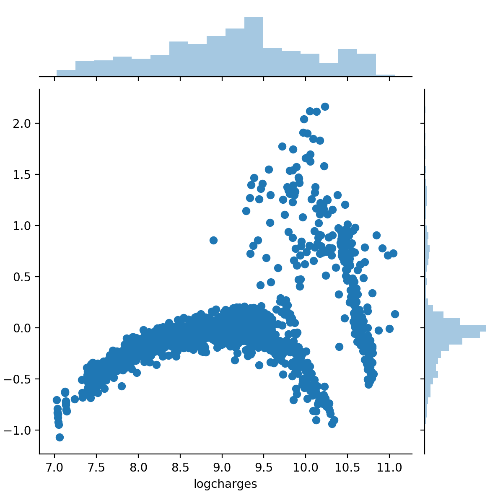
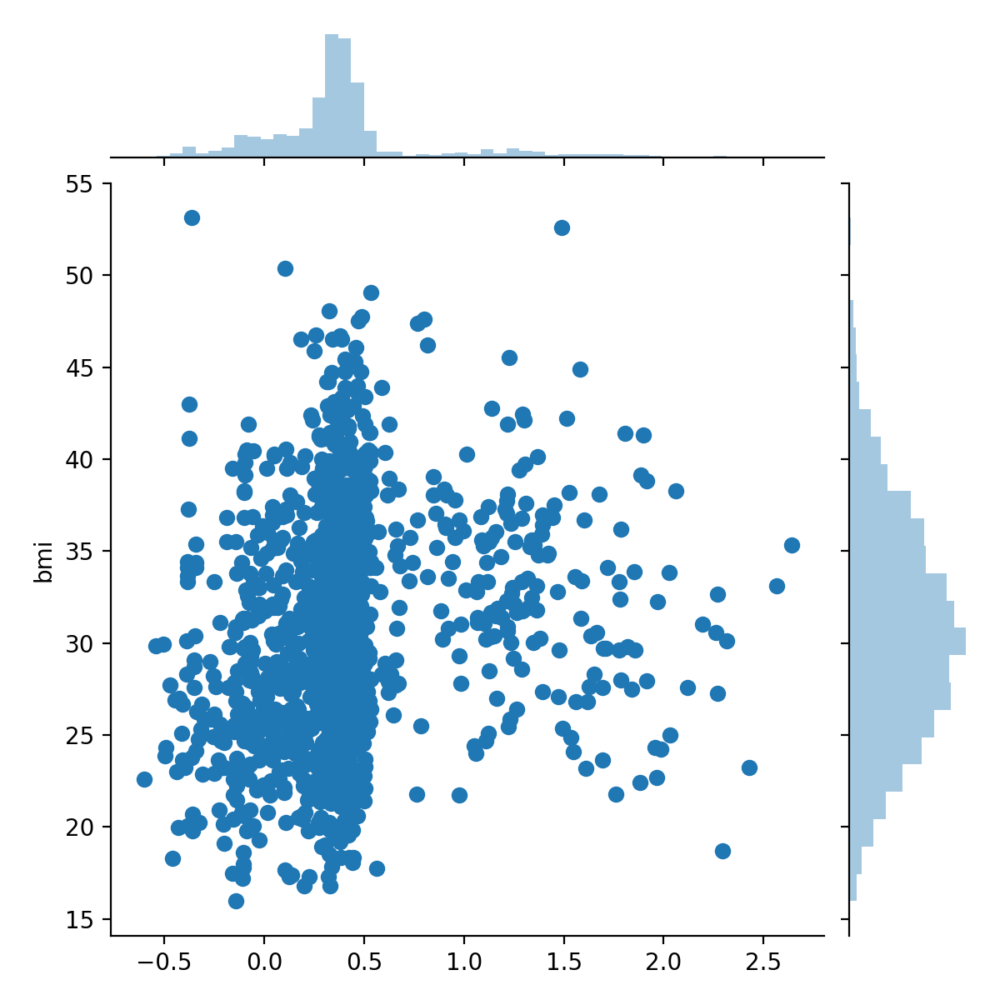

# {.tabset}

## Data Discription and Topic introduction {#tab-1}

_Since the topic we chose is easy but sophisticated, the code and inference for each programming language would be rather long_ :( 

### Data Discription

The data we use is a medical cost personal dataset accessible on Kaggle (https://www.kaggle.com/mirichoi0218/insurance).
```{r}
library(data.table)
setwd("~/Desktop/group_project/group_project/final_version/")
insurance <- fread("insurance.csv")
head(insurance)
```
Age is the age of the people.
Sex is the gender.
Bmi refers to the Body Mass Index (BMI).
Children refers to the number of child one has.
Smoker indicates whether given people smoke. 
Region describes in which of four regions (southwest, southeast, northeast, northwest) one lives in. 
Charges is the insurance cost in dollar. 
The data visualization is done in all three language. 
In this turorial,our goal is to estimated a linear model which predicts the insurance charges upon the above dataset.

### Topic: Linear Regression, Model Selection and Model Diagnostics
#### Introduction
Formal definition from \emph{Linear Models with R}: Regression analysis is used for explaining or modeling the relationship between a single variable Y, called the response, output or dependent variable; and one or more predictor, input, independent or explanatory variables, $X_1$...$X_p$. When $p=1$, it is called simple regression but when $p>1$ it is called multiple regression or sometimes multivariate regression. (Faraway, J 2009)
An informal interpretation is that linear regression establish a linear relationship between the response variable and independent variable(s) in a data set. It is widely applied in many areas such as sciences, engineering and machine learning.
Mathematically:
\begin{equation}
Y = \beta_0 + \beta_1 X_1 + \beta_2 X_2 + ... + \beta_n X_n
\end{equation}
#### Solving linear regression problems with least square
One well defined way to solve for $\beta$ is called the least square method:
Using above definition, we can write:\begin{equation}
y = X \beta + \epsilon
\end{equation} 
with $y = [y_1, ..., y_n]^T$, $\epsilon = [\epsilon_1,..., \epsilon_n]^T$, $\beta = [\beta_0,...,\beta_m]^T$ and:\begin{equation}
    X = \begin{bmatrix}
    1 & x_{11}& x_{12}  & \dots & x_{1m} \\
    1 & x_{21}& x_{22}  & \dots & x_{2m} \\
    \vdots & \vdots & \vdots & \ddots & \vdots \\
    1 & x_{n1}& x_{d2}  & \dots & x_{nm}
\end{bmatrix}
\end{equation}
In above expression, $\epsilon$ is the residual, and one way to obtain best estimation of $\beta$ is to minimize:\begin{equation}
    \sum_{i=1}^n \epsilon_i^2 = \epsilon^T\epsilon
\end{equation}
The above equation can be rewritten as: \begin{equation}
    (y - X\beta)^T (y - X\beta) 
\end{equation}
Now, we take the differential of (4) with respect to $\beta$, notice that to minimize (4), the graident should be zero; thus: \begin{equation}
    X^TX\hat{\beta} = X^T y 
\end{equation}
in which $\hat{\beta}$ is our estimation of $\beta$. Rearranging (5) we get: \begin{equation}
     \hat{\beta} = (X^TX)^{-1}X^T y
\end{equation}
This is the norm equation. 

#### Diagnostic and Model Selection
Normally, there are numerous variables in a data set, and some of variables are actually correlated; then one problem is how to establish a rather simple model which could be easily interpret. One popular technique is the \emph{criterion-based Model Selection}. The idea is to choose model with respect to a specific criterion that measures the behavior of fit. In our project, we will introduce three common criterion: the \emph{Akaike information criterion (AIC)}, the \emph{Bayes information criterion (BIC)}, and the \emph{adjusted R square}. 
##### AIC
Before defining AIC, we first define the following values: 
Number of independent predictors p: $p = \# X_i$ 
Residual sum of square - RSS: \begin{equation}
    RSS = \hat{\epsilon}^T\hat{\epsilon} = (y - X\hat\beta)^T(y - X\hat\beta)
\end{equation}
And
\begin{equation}
    AIC = n \ln{(RSS/n)} + 2(p+1)
\end{equation}
Pick the model minimizes AIC.
##### BIC
\begin{equation}
    BIC = n \ln{(RSS/n)} + (p+1)\ln n
\end{equation}
Pick the model minimizes BIC.
##### Adjusted R square
The R square value is defined as:
\begin{equation}
    R^2 = 1 - \frac{RSS}{TSS}
\end{equation}
The adjusted R square value is:
\begin{equation}
    1 - \frac{n-1}{n-p-1}(1 - R^2)
\end{equation}
Select a model that maximize the adjusted $R^2$ value 

#### Structure examples in this tutorial
In each example, we start by data visualization. Then pick a strategy to scale the response. Then, we convert the categorical columns in predictors to dummy variables and regress on the full dataset. It turns out their is a clear linearity associated with residual. So we modify our model to reduce such linearity. Having the original model, we start by adding some interaction predictors in our model if two variables seems to have interacting effect on the response. For example, smoke:age. Next, we raise the power of continous predictor. Above diagonastic process reduce the linearity in residuals. Then, we regress the selected predictors against the original response, and do model selection. 

#### Citation:

1.Xie, Y. [Yihui Xie's knitr example](https://github.com/yihui/knitr-examples/blob/master/023-engine-python.Rmd) 

2.[A regression example in Kaggle](https://www.kaggle.com/sudhirnl7/linear-regrssion-tutorial)

3.Faraway, J. 2009. Linear Models with R. University of British Columbia, Canada. 

4.Shedden, K. [Proffessor Shedden's Notes on model diagostics](http://dept.stat.lsa.umich.edu/~kshedden/Courses/Regression_Notes/diagnostics.pdf)

5.Shedden, K. [Proffessor Shedden's Notes on model selection](http://dept.stat.lsa.umich.edu/~kshedden/Courses/Regression_Notes/model_selection.pdf)


## By Python {#tab-2}

### Python (Zhenbang Jiao)

```{r setup, include = FALSE}
devtools::install_github('rstudio/reticulate')
knitr::knit_engines$set(python = reticulate::eng_python)
```

The following packages are used in Python version of the tutorial.

```{python, eval = FALSE}
import pandas as pd
import numpy as np
import seaborn as sns
import matplotlib.pyplot as plt
from statsmodels.regression.linear_model import OLS
from statsmodels.tools import add_constant
```

```{python, include = FALSE,engine.path = '/Library/Frameworks/Python.framework/Versions/3.7/bin/python3.7'}
import pandas as pd
import numpy as np
from statsmodels.regression.linear_model import OLS
from statsmodels.tools import add_constant
```

#### Data Preprocessing

```{python,engine.path = '/Library/Frameworks/Python.framework/Versions/3.7/bin/python3.7'}
#read the data and save as a dataframe
ds0 = pd.DataFrame(pd.read_csv('~/Desktop/506/groupproject/insurance.csv'))

#have a glimpse of the data
print(ds0.head())
print(ds0.columns)

#check if there is any null
ds0.isnull().sum()
#no null :)
```

```{python,engine.path = '/Library/Frameworks/Python.framework/Versions/3.7/bin/python3.7'}
# map the character to factor variable
ds0.sex = ds0.sex.map({'female':1, 'male':0})
ds0.smoker = ds0.smoker.map({'yes':1, 'no':0})
ds_reg = pd.get_dummies(ds0['region'])

# since we change it to dummy variables, we have to drop one of the column
ds0 = ds0.join(ds_reg.iloc[:,0:3])
```

#### Data Visualization

```{python,engine.path = '/Library/Frameworks/Python.framework/Versions/3.7/bin/python3.7'}
ds0['logcharges'] = np.log(ds0.charges)
ds1 = ds0.drop(['charges','region'],axis=1)
```

```{r,echo=FALSE,fig.align='center', out.width='50%'}

```

```{python, eval = FALSE}
import seaborn as sns
import matplotlib.pyplot as plt
# As we can see, the charges have a heavy tail. So, we take log on it.
sns.distplot(ds0['charges'], color='b')
# Data in every other column looks fine right now.
f,ax = plt.subplots(2,3,figsize=(10,8))
sns.distplot(ds1["age"], kde=False, ax=ax[0,0])
sns.boxplot(x='sex',y='charges', data=ds0, ax=ax[0,1])
sns.distplot(ds1['logcharges'], ax=ax[0,2], kde=False, color='b')
# The logcharges are now normally distributed.
sns.distplot(ds1['bmi'],ax=ax[1,0], kde=False, color='b')
sns.countplot('children',data=ds1, ax=ax[1,1])
sns.countplot('region',data=ds0, ax=ax[1,2])

ax[0,0].set_title('Distribution of Ages')
ax[0,1].set_title('Charges boxplot by Sex')
ax[0,2].set_title('Distribution of log charges')
ax[1,0].set_title('Distribution of bmi')
ax[1,1].set_title('Distribution of children')
ax[1,2].set_title('Distribution of regions')
```

```{r,echo=FALSE,fig.align='center'}

```

#### Optional Step 

_Actually centralize is not a must, which would not change the general result of the regression. In this example, we won't do so._

```{python, eval = FALSE,engine.path = '/Library/Frameworks/Python.framework/Versions/3.7/bin/python3.7'}
def centralize(arra):
    cen = arra - np.mean(arra)
    var = np.sqrt(sum(cen**2)/(len(arra)-1))
    arra = cen/var
    return arra
ds0.bmi = centralize(ds0.bmi)
ds0.age = centralize(ds0.age)
```


#### Model Diagnostics

Firstly, we define dependent variable y and covariates X for future convenience.

```{python,engine.path = '/Library/Frameworks/Python.framework/Versions/3.7/bin/python3.7'}
y = ds1.logcharges
X = ds1.drop(['logcharges'], axis = 1)

#Conduct the first regression!
regr_1 = OLS(y, add_constant(X)).fit()
```

##### VIF

```{python,engine.path = '/Library/Frameworks/Python.framework/Versions/3.7/bin/python3.7'}
def variance_inflation_factor(exog, exog_idx):
    k_vars = exog.shape[1]
    x_i = exog.iloc[:, exog_idx]
    mask = np.arange(k_vars) != exog_idx
    x_noti = exog.iloc[:, mask]
    r_squared_i = OLS(x_i, x_noti).fit().rsquared
    vif = 1. / (1. - r_squared_i)
    return vif
    
# We skip the constant column.
VIF = [variance_inflation_factor(add_constant(X), i) for i in range(1,X.shape[1]+1)]
print(VIF)
```

The vif of each column is ok. All of them are smaller than 5, even 2. 


##### Residual Distribution
```{python, eval = FALSE}
sns.distplot(regr_1.resid) 
```

```{r,echo=FALSE,fig.align='center', out.width='50%'}
knitr::include_graphics("residual1.png")
```

Acting like normal which is good.
Since the residual itself is normal, box-cox is not necessary.

##### Box-Cox transformation
```{python, eval = FALSE}
namda = 0.1
regr_test = OLS((y**namda-1)/namda, add_constant(X)).fit()
sns.jointplot((y**namda-1)/namda, regr_test.resid)
sns.distplot(regr_test.resid)
```

##### Residual Plot
If the regression works well, the dependent data should be uncorrelated with the residual. If we have gaussian prerequisite, independence is what we expect.

```{python, eval = FALSE}
sns.jointplot(y, regr_1.resid) 
```

```{r,echo=FALSE,fig.align='center', out.width='50%'}

```

_The residual plot looks very strange. Y and residual are highly dependent. Maybe the model is not linear at the first place. Since there is explicit non-linear in this model, we have to add some non-linear covariates in it._

##### partial residual plot
Which attempts to show how covariate is related to dependent variable, if we control for the effects of all other covariates.

```{python, eval = FALSE}
f,ax = plt.subplots(1,2,figsize=(10,8))
sns.jointplot(regr_1.params.bmi * X.bmi + regr_1.resid, X.bmi, ax=ax[0,0])
sns.jointplot(regr_1.params.age * X.age + regr_1.resid, X.age, ax=ax[0,1])
```

```{r,echo=FALSE, out.width='50%'}

knitr::include_graphics("residual4.png")
```

Partial residual plots show that both bmi and age could significantly affect the charges.

#### Model Selection

For this part, we would try different adding variables and try to drop variables that are useless.
The primary concern in this case is that we have to add variables so that the residual is relatively indep with y.

* #### Original model
```{python,engine.path = '/Library/Frameworks/Python.framework/Versions/3.7/bin/python3.7'}
print(regr_1.summary())
```

logcharges = constant + age + sex + bmi + children + smoker + northeast + northwest + southeast

* #### The first try : add an interactive covariate smoker:bmi
```{python,engine.path = '/Library/Frameworks/Python.framework/Versions/3.7/bin/python3.7'}
X_2 = X.iloc[:,:]
X_2['sm_bm'] = X_2.smoker * X_2.bmi
regr_test = OLS(y, add_constant(X_2)).fit()
print(regr_test.summary())
# which certainly improve the performance of the model
```

* #### The second try : add an interactive covariate smoker:age
```{python,engine.path = '/Library/Frameworks/Python.framework/Versions/3.7/bin/python3.7'}
X_2['sm_ag'] = X_2.smoker*X_2.age
regr_test = OLS(y, add_constant(X_2)).fit()
print(regr_test.summary())
# which increase the performance of the model significantly
```

Since we only have two continuous covariates, we can try to give them an extra power.

* #### The third try : add $bmi^{1.5}$
```{python,engine.path = '/Library/Frameworks/Python.framework/Versions/3.7/bin/python3.7'}
X_2['bmi^1.5'] = X_2.bmi ** 1.5
regr_test = OLS(y, add_constant(X_2)).fit()
print(regr_test.summary())
```

* #### The fourth try: add $age^{1.5}$
```{python,engine.path = '/Library/Frameworks/Python.framework/Versions/3.7/bin/python3.7'}
X_2['age^1.5'] = X_2.age ** 1.5
regr_test = OLS(y, add_constant(X_2)).fit()
print(regr_test.summary())
```

* #### The fifth try: What if we take the ~~log~~ away? 
**Caution: this procedure is not a typical one for model selectiom. But if we take off the log, the performance certainly get better.**

```{python,engine.path = '/Library/Frameworks/Python.framework/Versions/3.7/bin/python3.7'}
y_2 = ds0.charges
regr_test = OLS(y_2, add_constant(X_2)).fit()
print(regr_test.summary())
```

Now we have added all the possible covariates we can, we can consider drop some of them. As we can see from the summary, it seems that the region para is not that important.

```{python,engine.path = '/Library/Frameworks/Python.framework/Versions/3.7/bin/python3.7'}
X_3 = X_2.drop(columns = ['northwest', 'southeast'])
regr_3 = OLS(y_2, add_constant(X_3)).fit()
print(regr_3.summary())
```
the AIC and BIC actually get smaller.

Similarly smoker:age is not that important either.
```{python,engine.path = '/Library/Frameworks/Python.framework/Versions/3.7/bin/python3.7'}
X_4 = X_3.drop(columns = ['sm_ag'])
regr_4 = OLS(y_2, add_constant(X_4)).fit()
print(regr_4.summary())
```

After the model selection part, we now have our residual:
```{python, eval = FALSE}
sns.residplot(np.sum(regr_4.params*X_4,1)+regr_4.params[0], y_2)
```
Which is much more acceptable than before.

```{r,echo=FALSE,fig.align='center', out.width='50%'}

```

####Summary

For now, the best model would be:

   charges = constant + age + sex + bmi + children + smokeryes + northeastornot + sm_bm + $bmi^{1.5}$ + $age^{1.5}$

The coefficients are accessible on the table above. We have Adjusted $R^{2}$ at 0.843, which is much better than 0.767 from the original model. So, till now, we have solved the residual's problem and increased the Adjusted $R^{2}$ significantly. It is a pretty complete model diagnostics and model selection process.

**Caution: As you may see, the coefficient of smokeryes is negative. Please don't take the result as smoking is good for your health. Since smoke is also used in smoke:bmi, bmi is large. So the bad influence of smoking has been transferred to the smoke:bmi term.**


## By R {#tab-3}


### R (Mimi Tran)

```{r, include=FALSE}
knitr::opts_chunk$set(echo = TRUE)
```

The following packages are used in R version of the tutorial.

```{r,eval=FALSE, echo=TRUE}
# libraries--------------------------------------------------------------------
library(faraway)
library(readr)
library(dplyr)
```

#### Data Preprocessing

```{r group19_source, include = FALSE}
source('group19.R')
```

```{r}
# Load data--------------------------------------------------------------------
ds0 <- read_csv("insurance.csv")
names(ds0)
#have a glimpse of the data
head(ds0)
```

```{r, eval=FALSE, echo=TRUE}
# Check if is there any null---------------------------------------------------
is.na(ds0)
```

No missing value, we're good.

```{r}
# Recode: sex:femal = 1, male = 0, smoke: yes=1, no=0
ds0$sex[ds0$sex == "male"]="0"
ds0$sex[ds0$sex == "female"]="1"
ds0$smoker[ds0$smoker == "no"]="0"
ds0$smoker[ds0$smoker == "yes"]="1"
```

#### Data Visualization

```{r}
# Examining the distribution of each variables---------------------------------
hist(ds0$age,xlab="Age", main="Distribution of Age")
hist(ds0$bmi,xlab="BMI", main="Distribution of BMI")
hist(ds0$children,xlab="Children", main="Distribution of Children")
hist(ds0$charges,xlab="Charges", main="Distribution of Charges")
```

```{r}
# Take log for charge since its heavy tail-------------------------------------
ds0$logcharges <- log(ds0$charges+1)
```

```{r hist_chart,message=FALSE}
hist(ds0$charges)
ds0$logcharges <- log(ds0$charges+1)
hist(ds0$logcharges, breaks = 10)
```

#### Model Dignostics

Firstly, we define dependent variable y and covariates X. In this analysis, the reponse is *logcharges* and the preditors are *age*, *sex*, *bmi*, *children*, *smoker*, and *region* .

### VIF

```{r}
# Conduct the first regression!
# Since they're all smaller than 5, even smaller than 2.
fit0 <- lm(logcharges ~age+sex+bmi+children+smoker+as.factor(region), data=ds0)
X <- model.matrix(fit0)[, -1]
round(vif(X),2)
```


```{r residual_distribution}
hist(fit0$residuals, xlab="Residuals")
plot(fit0$res, xlab="Residuals")
abline(h=0) # acting like noraml so it's good.

```


### Residual plots

```{r partial_residual_plot}
plot(fit)
```

### Partial residual plots

```{r}
# Partial residual plots-------------------------------------------------------
#Which attempts to show how covariate is related to dependent variable
# if we control for the effects of all other covariates
# partial residual plots look acceptable.
fit <- lm(logcharges~ bmi, data=ds0)
plot(fit)
```

#### Model Selection

For this part, we would try different adding variables and try to drop variables that are useless.
The primary concern in this case is that we have to add variables so that the residual is relatively indep with y.

* ### Original model

```{r}
fit0 <- lm(logcharges ~age+sex+bmi+children+smoker+as.factor(region), data=ds0)
summary(fit0)
AIC(fit0)
BIC(fit0)
```

* ### The first try: add interactive covariate smoker*bmi

```{r}
fit1 <-lm(logcharges ~age+sex+bmi+children+smoker+as.factor(region)+smoker*bmi, data=ds0)
summary(fit1)
BIC(fit1)
# which certainly improve the performance of the model
```

* ### The second try: add an interactive covariate smoker*age

```{r}
fit2 <-lm(logcharges ~age+sex+bmi+children+smoker+as.factor(region)+smoker*bmi+as.numeric(smoker)*age, data=ds0)
summary(fit2)
BIC(fit2)
# which increase the performance of the model significantly
```

Since we only have two continuous covariates, we can try to give them an extra power.

* ### The third try: add $bmi^{1.5}$

```{r}
 #since we only have two continuous covariates, we can try to give them an extra power, add bmi^1.5.
fit3 <-lm(logcharges ~age+sex+bmi+children+smoker+as.factor(region)+
            smoker*bmi,as.numeric(smoker)*age+bmi^1.5, data=ds0)
summary(fit3)
BIC(fit3)
```

* ### The fourth try: add $age^{1.5}$

```{r}
fit4 <-lm(logcharges ~age+sex+bmi+children+smoker+as.factor(region)+
            smoker*bmi,as.numeric(smoker)*age+bmi^1.5+age^1.5, data=ds0)
summary(fit4)
BIC(fit4)
```

* ### The fifth try: What if we take the ~~log~~ away? so we use charges instead of logcharges for the response. 
 
```{r}
fit5 <-lm(charges ~age+sex+bmi+children+smoker+as.factor(region)+
            smoker*bmi,as.numeric(smoker)*age+bmi^1.5+age^1.5, data=ds0)
summary(fit5)
BIC(fit5)
```

**Caution: this procedure is not a typical one for model selectiom. But if we take off the log, the performance certainly get better.**

Now we have added all the possible covariates we can, we can consider drop some of them. As we can see from the summary, it seems that the region parameter is not that important, so I'm only keep *northeast* in *region* column.

```{r}
new_ds0 <- ds0[which(ds0$region=="northeast"),]
#Recode: sex:femal = 1, male = 0, smoke: yes=1, no=0
new_ds0$sex[new_ds0$sex == "male"]="0"
new_ds0$sex[new_ds0$sex == "female"]="1"
new_ds0$smoker[new_ds0$smoker == "no"]="0"
new_ds0$smoker[new_ds0$smoker == "yes"]="1"
```

```{r}
# Now fit the model with only region is northeast.
fit6 <- lm(charges ~age+sex+bmi+children+smoker+smoker*bmi+
             as.numeric(smoker)*age+I(bmi^1.5)+I(age^1.5), data=new_ds0)
summary(fit6)
AIC(fit6)
BIC(fit6)
```

The AIC and BIC actually get smaller.

Similarly smoker*age is not that important either.

```{r, eval = FALSE, echo= TRUE}
fit7 <- lm(charges ~age+sex+bmi+children+smoker+smoker*bmi+region+I(bmi^1.5)+I(age^1.5),data=new_ds0)
summary(fit7)
AIC(fit7)
BIC(fit7)

```
```{r}
summary(fit7)
AIC(fit7)
BIC(fit7)
```

After dropping smoker*age, AIC and BIC values stay the same.For now, the best model would be:
charges = constant + age + sex + bmi + children + smokeryes + northeastornot + sm_bm + $bmi^{1.5}$ + $age^{1.5}$

**Caution: As you may see, the coefficient of smoker1 is negative. Please don't take the result as smoking is good for your health. Since smoke is also used in smoke:bmi, bmi is large. So the bad influence of smoking has been transferred to the smoke:bmi term.**

## By Matlab {#tab-4}

### Matlab (Yijia Zhang)

#### Importing and modifying data
```{}
insurance = readtable('insurance.csv');
data = insurance;
%Transfer categorical value to numerical value
X = data(:,1:6);
Y = data(:,7);
[GN, ~, G] = unique(X(:,2));
X.sex = G-1;
X.smoker = strcmp(X.smoker, 'yes');
head(X)
```
Result:
```{}
    age    sex     bmi      children    smoker      region   
    ___    ___    ______    ________    ______    ___________

    19      0       27.9       0        true      'southwest'
    18      1      33.77       1        false     'southeast'
    28      1         33       3        false     'southeast'
    33      1     22.705       0        false     'northwest'
    32      1      28.88       0        false     'northwest'
    31      0      25.74       0        false     'southeast'
    46      0      33.44       1        false     'southeast'
    37      0      27.74       3        false     'northwest'
```
Now we are ready to see the distribution of each cols and select a strategy to estimate our model:
```{}
figure(1)
histogram(data.age,'BinWidth',5);
xlabel('Age');
ylabel('Frequency');
```
The distribution of age:
```{r pressure1, echo=FALSE, fig.cap="Age distribution", out.width = '100%'}

```
The distribution of sex:
```{}
figure(2)
C = categorical(X.sex,[0 1],{'Female','Male'});
histogram(C,'BarWidth',0.5);
xlabel('Sex');
ylabel('Frequency');
```

```{r pressure2, echo=FALSE, fig.cap="Sex distribution", out.width = '100%'}

```
The distribution of bmi:
```{}
figure(3)
histogram(data.bmi);
xlabel('bmi');
ylabel('Frequency');
```

```{r pressure3, echo=FALSE, fig.cap="Bmi distribution", out.width = '100%'}

```
The distribution of Children:
```{}
figure(4)
histogram(data.children);
xlabel('children');
ylabel('Frequency');
```

```{r pressure4, echo=FALSE, fig.cap="Children distribution", out.width = '100%'}

```

The distribuition of Smoker:
```{}
figure(5)
C0 = categorical(X.smoker,[0 1],{'No','Yes'});
histogram(C0, 'BarWidth',0.5);
xlabel('smoker');
ylabel('Frequency');
```

```{r pressure5, echo=FALSE, fig.cap="Smoker distribution", out.width = '100%'}

```
The distribution of Region:
```{}
figure(6)
C1 = categorical(data.region);
histogram(C1, 'BarWidth',0.5);
xlabel('Region');
ylabel('Frequency');
```

```{r pressure6, echo=FALSE, fig.cap="Region distribution", out.width = '100%'}

```
The distribution of Charges:
```{}
figure(7)
histogram(data.charges,'BinWidth',5000);
xlabel('charges');
ylabel('Frequency');
```

```{r pressure7, echo=FALSE, fig.cap="Charges distribution", out.width = '100%'}

```
Since Y is the response and it has a heavy-tail distribution, one general way to fit it is to take the log:
```{}
Y.charges = log(Y.charges);
figure(8)
histogram(Y.charges,'BinWidth',0.5);
xlabel('ln-charges');
ylabel('Frequency');
```
The log charge histogram:
```{r pressure8, echo=FALSE, fig.cap="log_Charges distribution", out.width = '100%'}

```
Now, it is a bell-shaped distribution. 
To regress the full set of data, we have to convert region into dummy variables:
```{}
X.southwest = ( strcmp(X.region ,'southwest'));
X.northwest = ( strcmp(X.region ,'northwest'));
X.southeast = ( strcmp(X.region ,'southeast'));
X = removevars(X,{'region'});
head(X)
```
Result
```{}
    age    sex     bmi      children    smoker    southwest    northwest    southeast
    ___    ___    ______    ________    ______    _________    _________    _________

    19      0       27.9       0        true        true         false        false  
    18      1      33.77       1        false       false        false        true   
    28      1         33       3        false       false        false        true   
    33      1     22.705       0        false       false        true         false  
    32      1      28.88       0        false       false        true         false  
    31      0      25.74       0        false       false        false        true   
    46      0      33.44       1        false       false        false        true   
    37      0      27.74       3        false       false        true         false  
```

#### Regression and model selection
Note, in this section each $X_n$ is correspond the $n^{th}$ predictor in the following predictors list:
{age      sex     bmi      children    smoker    southwest    northwest    southeast    smokerbmi    smokerage}
We start by regressing the full set of predictors:
```{}
x = X{:,:};
[m,p] = size(x);
y = Y{:,:};
n = length(y);
mdl = fitlm(x,y)
mdl.ModelCriterion

```

```{}
mdl = 


Linear regression model:
    y ~ 1 + x1 + x2 + x3 + x4 + x5 + x6 + x7 + x8

Estimated Coefficients:
                   Estimate         SE         tStat       pValue   
                   _________    __________    _______    ___________

    (Intercept)       7.0306      0.072396     97.112              0
    x1              0.034582    0.00087205     39.655    1.3701e-227
    x2             -0.075416      0.024401    -3.0907      0.0020384
    x3              0.013375      0.002096     6.3811     2.4234e-10
    x4               0.10186      0.010099     10.085     4.2411e-23
    x5                1.5543      0.030279     51.333    1.1199e-317
    x6              -0.12895      0.035027    -3.6815     0.00024116
    x7             -0.063788      0.034906    -1.8274        0.06786
    x8               -0.1572      0.035083    -4.4807     8.0776e-06


Number of observations: 1338, Error degrees of freedom: 1329
Root Mean Squared Error: 0.444
R-squared: 0.768,  Adjusted R-Squared 0.767
F-statistic vs. constant model: 550, p-value = 0

```
AIC and BIC
```{}
     AIC: 1.6350e+03
    AICc: 1.6352e+03
     BIC: 1.6818e+03
    CAIC: 1.6908e+03
```

Plot the residual:
```{}
%Plot residual
figure(9)
plotResiduals(mdl);
%Normal probability plot
figure(10)
plotResiduals(mdl,'probability');
figure(11)
plotResiduals(mdl,'fitted');
```
Plot1:
```{r pressure9, echo=FALSE, out.width = '100%'}

```
Plot2
```{r pressure10, echo=FALSE, out.width = '100%'}

```

```{r pressure11, echo=FALSE, out.width = '100%'}

```
It turns out that residuals have some linear relationship, so we have to modify our model.

We use formula from Belsley, D. A., E. Kuh, and R. E. Welsch. Regression Diagnostics. Hoboken, NJ: John Wiley & Sons, 1980 in open toolbox to check the VIF. It turns our they are limited and most of them are lower than 5.  
```{}
function [V]=vif(X)
R0 = corrcoef(X); % correlation matrix
V=diag(inv(R0))';

```
Our first try is to add some interactive elements in our model smoker:bmi:
```{}
x1 = X;
x1.smokerbmi = x1.smoker.*x1.bmi;
x11 = x1{:,:};
[m1,p1] = size(x11);
mdl2 = fitlm(x11,y);
mdl2.ModelCriterion;

```
Regression Output
```{}

mdl2 = 


Linear regression model:
    y ~ 1 + x1 + x2 + x3 + x4 + x5 + x6 + x7 + x8 + x9

Estimated Coefficients:
                   Estimate         SE         tStat       pValue   
                   _________    __________    _______    ___________

    (Intercept)       7.3374      0.076673     95.697              0
    x1              0.034795    0.00084289     41.281    2.4521e-240
    x2             -0.087064      0.023607     -3.688     0.00023512
    x3              0.003406     0.0022676      1.502        0.13334
    x4               0.10315     0.0097594     10.569     3.9892e-25
    x5               0.15642         0.146     1.0714         0.2842
    x6              -0.13751      0.033856    -4.0617     5.1563e-05
    x7             -0.071131      0.033735    -2.1085       0.035176
    x8              -0.16273      0.033903    -4.7998     1.7681e-06
    x9              0.045574     0.0046633      9.773     7.8431e-22


Number of observations: 1338, Error degrees of freedom: 1328
Root Mean Squared Error: 0.429
R-squared: 0.784,  Adjusted R-Squared 0.782
F-statistic vs. constant model: 534, p-value = 0

```
AIC and BIC
```{}
     AIC: 1.5441e+03
    AICc: 1.5443e+03
     BIC: 1.5961e+03
    CAIC: 1.6061e+03

```
We see an increase in Adjusted R-square and a decrease in BIC, so we retain this new interactive predictor.

Our second try is to add an interactive predictor:  smoker:age
```{}
x2 = X;
x2.smokerbmi = x2.smoker.*x2.bmi;
x2.smokerage = x2.smoker.*x2.age;
x12 = x2{:,:};
[m2,p2] = size(x12);
mdl3 = fitlm(x12,y);
mdl3.ModelCriterion;

```
Regression output
```{}
mdl3 = 


Linear regression model:
    y ~ 1 + x1 + x2 + x3 + x4 + x5 + x6 + x7 + x8 + x9 + x10

Estimated Coefficients:
                   Estimate         SE         tStat       pValue   
                   _________    __________    _______    ___________

    (Intercept)       7.1326      0.069955     101.96              0
    x1              0.041573    0.00084966      48.93    2.0913e-299
    x2             -0.085616      0.021242    -4.0305     5.8833e-05
    x3             0.0011516     0.0020444    0.56331        0.57332
    x4               0.10633     0.0087834     12.106     4.5087e-32
    x5                1.2793       0.14589     8.7689      5.423e-18
    x6              -0.15093      0.030473    -4.9529     8.2515e-07
    x7              -0.06492      0.030357    -2.1385       0.032657
    x8              -0.14486      0.030523    -4.7459     2.3003e-06
    x9              0.051037     0.0042074      12.13     3.4458e-32
    x10            -0.033401     0.0018873    -17.698     4.3552e-63


Number of observations: 1338, Error degrees of freedom: 1327
Root Mean Squared Error: 0.386
R-squared: 0.825,  Adjusted R-Squared 0.824
F-statistic vs. constant model: 625, p-value = 0
  
```
AIC and BIC
```{}
     AIC: 1.2626e+03
    AICc: 1.2628e+03
     BIC: 1.3198e+03
    CAIC: 1.3308e+03
  
```
Retain this predictor for samiliar reason. 
Now, since there are only two coninuous predictors, one useful idea is to raise their power since we expect the continous variables can explain more change in response than logical variable. 
Add bmi^1.5
```{}
x3 = x2;
x3.bmi = x3.bmi+x3.bmi.^1.5;
x13 = x3{:,:};
[m3,p3] = size(x13);
mdl4 = fitlm(x13,y);
mdl4.ModelCriterion;
```
Regression output
```{}
mdl4 = 


Linear regression model:
    y ~ 1 + x1 + x2 + x3 + x4 + x5 + x6 + x7 + x8 + x9 + x10

Estimated Coefficients:
                    Estimate         SE         tStat       pValue   
                   __________    __________    _______    ___________

    (Intercept)         7.152       0.05642     126.76              0
    x1               0.041601    0.00084936     48.979    8.7652e-300
    x2              -0.085515      0.021244    -4.0254     6.0099e-05
    x3             6.9951e-05    0.00021768    0.32136        0.74799
    x4                0.10637     0.0087842     12.109     4.3441e-32
    x5                 1.2662       0.14588     8.6796      1.144e-17
    x6               -0.15044      0.030469    -4.9375     8.9176e-07
    x7              -0.064937      0.030361    -2.1388       0.032633
    x8               -0.14327      0.030536    -4.6916     2.9908e-06
    x9               0.051497     0.0042081     12.238     1.0536e-32
    x10             -0.033429     0.0018876     -17.71      3.634e-63


Number of observations: 1338, Error degrees of freedom: 1327
Root Mean Squared Error: 0.386
R-squared: 0.825,  Adjusted R-Squared 0.824
F-statistic vs. constant model: 625, p-value = 0
```

AIC and BIC
```{}
     AIC: 1.2628e+03
    AICc: 1.2630e+03
     BIC: 1.3200e+03
    CAIC: 1.3310e+03
  
```

Add age^1.5
```{}
x4 = x3;
x4.age = x4.age+x4.age.^1.5;
x14 = x4{:,:};
mdl5 = fitlm(x14,y);
mdl5.ModelCriterion;
```
Regression output
```{}

mdl5 = 


Linear regression model:
    y ~ 1 + x1 + x2 + x3 + x4 + x5 + x6 + x7 + x8 + x9 + x10

Estimated Coefficients:
                   Estimate         SE         tStat       pValue   
                   _________    __________    _______    ___________

    (Intercept)       7.5956       0.05336     142.35              0
    x1             0.0039719    8.3054e-05     47.824    5.3991e-291
    x2              -0.08619       0.02157    -3.9958     6.8006e-05
    x3             6.153e-05    0.00022107    0.27832        0.78081
    x4               0.11671     0.0089159     13.091     6.4801e-37
    x5                1.2569       0.14813     8.4854     5.6652e-17
    x6              -0.15002      0.030937    -4.8492     1.3859e-06
    x7             -0.065807      0.030828    -2.1347       0.032969
    x8              -0.14376      0.031006    -4.6367     3.8901e-06
    x9              0.051251     0.0042726     11.995     1.5076e-31
    x10            -0.032981     0.0019157    -17.216     4.1606e-60


Number of observations: 1338, Error degrees of freedom: 1327
Root Mean Squared Error: 0.392
R-squared: 0.819,  Adjusted R-Squared 0.818
F-statistic vs. constant model: 602, p-value = 0
```
AIC and BIC
```{}
     AIC: 1.3036e+03
    AICc: 1.3038e+03
     BIC: 1.3608e+03
    CAIC: 1.3718e+03
  
```
Now,plot the resiudal against fitted value. We find that, although there is still colinearity, but now less scatter points are on the above linear line. 
```{r pressure12, echo=FALSE, out.width = '100%'}

```

Now, let's try to fit previous preditors with the original response:
Refit the model:
```{}
x_1 = x4;
x_11 = x_1{:,:};
y_1 = data.charges;
mdl6 = fitlm(x_11,y_1);
mdl6.ModelCriterion;
```
Regression output:
```{}
mdl6 = 


Linear regression model:
    y ~ 1 + x1 + x2 + x3 + x4 + x5 + x6 + x7 + x8 + x9 + x10

Estimated Coefficients:
                   Estimate      SE       tStat        pValue   
                   ________    ______    ________    ___________

    (Intercept)     773.81     656.17      1.1793         0.2385
    x1              25.752     1.0213      25.215    6.1455e-115
    x2             -500.25     265.25      -1.886       0.059515
    x3              1.6724     2.7185     0.61517        0.53855
    x4              582.65     109.64      5.3143     1.2549e-07
    x5              -20379     1821.5     -11.188     7.8924e-28
    x6             -1224.5     380.43     -3.2186      0.0013191
    x7             -588.75     379.09     -1.5531        0.12064
    x8             -1185.7     381.28     -3.1099      0.0019113
    x9              1448.5      52.54      27.569    1.1927e-132
    x10            -5.0746     23.558    -0.21541        0.82948


Number of observations: 1338, Error degrees of freedom: 1327
Root Mean Squared Error: 4.82e+03
R-squared: 0.843,  Adjusted R-Squared 0.841
F-statistic vs. constant model: 710, p-value = 0
```
AIC and BIC
```{}
     AIC: 2.6504e+04
    AICc: 2.6504e+04
     BIC: 2.6561e+04
    CAIC: 2.6572e+04
```
We see both an increase in BIC and adjusted R squared value. So, if we are selecting model with respect to adjusted R, we should stop here. Otherwise we continous to next step. 
It turns out that region is not a very significant predictor, so we only keep southwest which has the lowest P-value. 
Refit the model. Note $X_n$ correspond to {age    sex    bmi     children    smoker    northwest    smokerbmi    smokerage    age15     bmi15 }
```{}
x_2 = x2;
x_2.age15 = x_2.age.^1.5;
x_2.bmi15 = x_2.bmi.^1.5;
x_2 = removevars(x_2,{'southwest','southeast'});
x_12 = x_2{:,:};
y_1 = data.charges;
mdl7 = fitlm(x_12,y_1);
mdl7.ModelCriterion;
```
Regression result
```{}
mdl7 = 


Linear regression model:
    y ~ 1 + x1 + x2 + x3 + x4 + x5 + x6 + x7 + x8 + x9 + x10

Estimated Coefficients:
                   Estimate      SE       tStat        pValue   
                   ________    ______    ________    ___________

    (Intercept)    -6048.4     3674.8     -1.6459        0.10002
    x1             -320.92     125.36     -2.5601       0.010575
    x2             -504.03     264.88     -1.9029       0.057269
    x3                1020     328.62       3.104      0.0019494
    x4              672.29     114.72      5.8603     5.8227e-09
    x5              -20140     1818.8     -11.073      2.558e-27
    x6              133.45     311.08     0.42899          0.668
    x7              1439.6     52.452      27.446    1.0272e-131
    x8             -3.7246     23.494    -0.15854        0.87406
    x9              62.475     13.353      4.6786     3.1841e-06
    x10            -121.14     39.114     -3.0972      0.0019944


Number of observations: 1338, Error degrees of freedom: 1327
Root Mean Squared Error: 4.82e+03
R-squared: 0.843,  Adjusted R-Squared 0.842
F-statistic vs. constant model: 712, p-value = 0
```
AIC and BIC
```{}
     AIC: 2.6500e+04
    AICc: 2.6500e+04
     BIC: 2.6557e+04
    CAIC: 2.6568e+04
```
It turns out that smoker:age has a really high P value, so we drop it. Now we have predictors:

 {age    sex    bmi     children    smoker    northwest   smokerbmi  age15  bmi15 }
 
```{}
x_3 = x_2;
x_3 = removevars(x_3,{'smokerage'});
x_13 = x_3{:,:};
y_1 = data.charges;
mdl8 = fitlm(x_13,y_1);
mdl8.ModelCriterion;
```
Regression result
```{}
mdl8 = 


Linear regression model:
    y ~ 1 + x1 + x2 + x3 + x4 + x5 + x6 + x7 + x8 + x9

Estimated Coefficients:
                   Estimate      SE       tStat       pValue   
                   ________    ______    _______    ___________

    (Intercept)    -6021.6     3669.5     -1.641        0.10104
    x1             -321.58     125.24    -2.5678       0.010345
    x2             -504.19     264.78    -1.9042       0.057097
    x3              1019.8     328.49     3.1046      0.0019457
    x4              671.94     114.66     5.8604     5.8154e-09
    x5              -20265     1636.9     -12.38     2.1457e-33
    x6              132.94     310.95    0.42753        0.66907
    x7                1439     52.293     27.518    2.7926e-132
    x8              62.466     13.348     4.6796     3.1676e-06
    x9              -121.1     39.098    -3.0972      0.0019944
```
AIC and BIC
```{}
     AIC: 2.6498e+04
    AICc: 2.6498e+04
     BIC: 2.6550e+04
    CAIC: 2.6560e+04
```
After dropping smokerage, AIC and BIC values stay the same.For now, the best model would be: 

charges = constant + age + sex + bmi + children + smokeryes + northeastornot + sm_bm + $bmi^{1.5}$ + $age^{1.5}$
